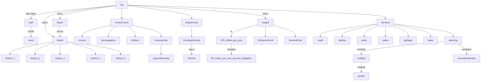

```mermaid

graph TD;
  city-->|has many| staff;
  staff --> |is 594| count
  city --> |has a| Mayor
  city --> |has a| Board
  Mayor --> |sits on| Board

  Board --> District_1
  Board --> District_2
  Board --> District_3
  Board --> District_4
  Board --> District_5

  city --> censusTracts
  censusTracts --> income
  censusTracts --> demographics
  censusTracts --> children
  censusTracts --> housingUnits --> typesOfHousing

  city --> departments
  departments --> HousingAuthority --> |has a| Director

  city --> |has a| budget --> |is| 220_million_per_year
  220_million_per_year --> |includes| 90_million_per_year_pension_obligation
  budget --> EnterpriseFund
  budget --> GeneralFund

  city --> Services

  Services --> roads
  Services --> lighting
  Services --> parks
  Services --> safety
  Services --> garbage
  Services --> water
  Services --> planning --> |involves| building --> |impacts| growth
  planning --> |considers| evacuationRoutes


```