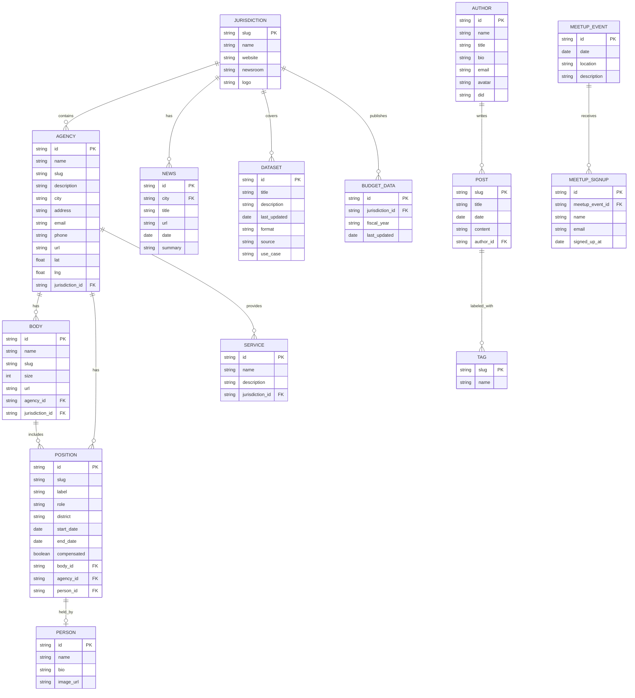

# Data Model

This documents the domain entities, their attributes, and relationships. It formalizes what already exists in the Jekyll collections and data files, plus planned entities from user stories.

## Entity Relationship Diagram

## Entity Descriptions

| Entity | Source | Status | Notes |
|--------|--------|--------|-------|
| JURISDICTION | `_data/solano_cities.yml` + `_jurisdictions/` collection | Partial | Data file populated; collection empty. Consolidate to one source. |
| AGENCY | `_agencies/` collection | Active | 3 items. References jurisdiction, bodies, positions, services. |
| BODY | `_bodies/` collection | Active | 9 items. City councils and boards. |
| POSITION | `_positions/` collection | Active | 46 items. Roles within bodies. |
| PERSON | `_people/` collection | Empty | Collection defined but no entries. Positions reference person but link is null. |
| SERVICE | `_services/` collection | Empty | Collection defined but no entries. |
| POST | `_posts/` collection | Active | 9 blog posts. |
| AUTHOR | `_data/authors.yml` | Active | 3 authors with rich metadata including DIDs. |
| TAG | Implicit in post frontmatter | Active | No standalone tag definitions; derived from post `tags[]`. |
| DATASET | `_data/datasets.yml` | Active | 5 dataset catalog entries. No actual downloadable files yet. |
| BUDGET_DATA | Planned | Missing | Referenced in stories (RS-1) but no data files exist. |
| NEWS | `_data/solano_city_news.yml` | Active | Weekly city news highlights. |
| MEETUP_EVENT | Hardcoded in `meetup.html` | Partial | No structured data; date/location are in page HTML. |
| MEETUP_SIGNUP | External (Airtable) | External | Signup form posts to Airtable; no local data. |

## Gaps

1. **PERSON** collection is empty — positions have dangling `person.data` references.
2. **JURISDICTION** has dual sources (`solano_cities.yml` and `_jurisdictions/` collection) — should consolidate.
3. **BUDGET_DATA** is referenced in stories but has no implementation yet.
4. **MEETUP_EVENT** is not structured data — dates are hardcoded in HTML.
5. **TAG** has no canonical list — derived implicitly from posts.
